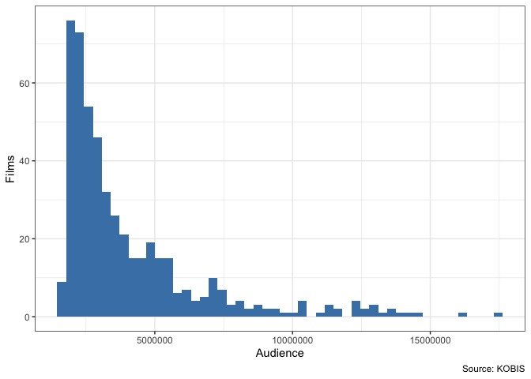
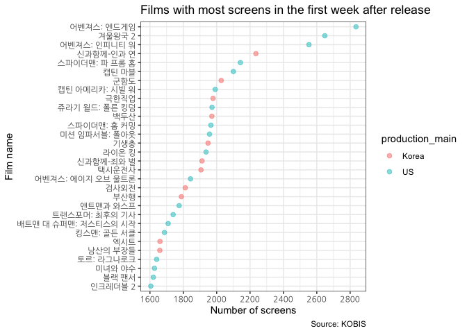
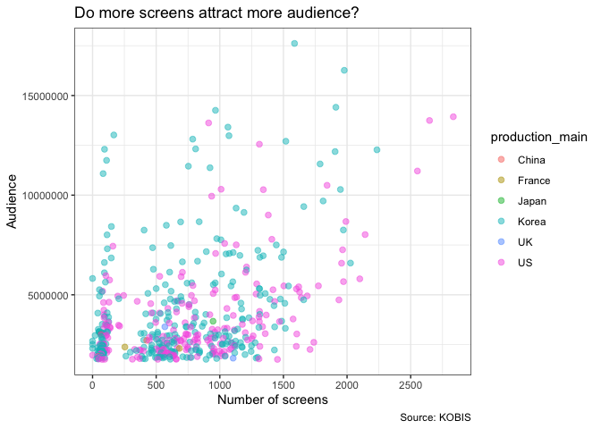
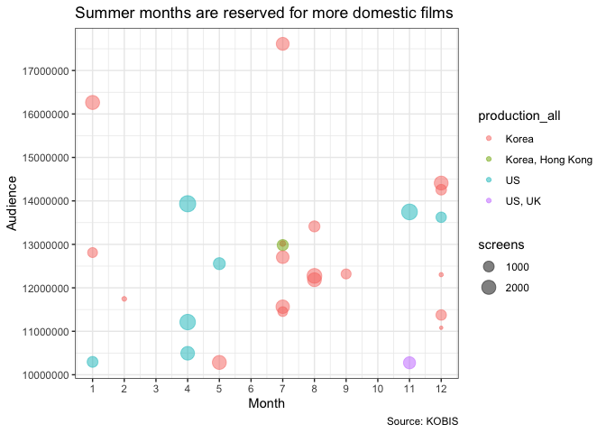
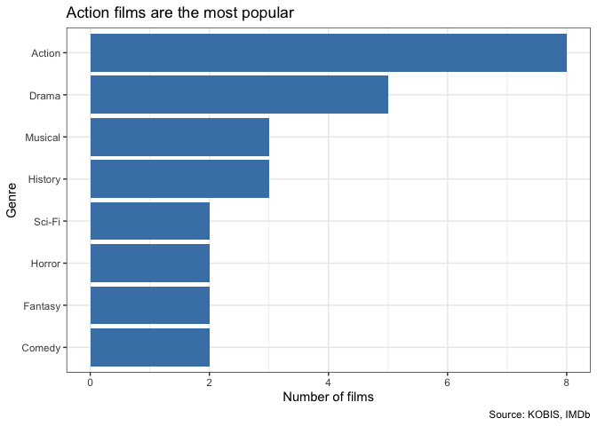

## Introduction

The datasets were obtained on March 20, 2020 from the [KOREA Box-office Information System](http://www.kobis.or.kr/kobis/business/main/main.do) (KOBIS). The system is run by the Korean Film Council (KOFIC), a government-supported, self-administered organization aiming to promote Korean films at home and abroad. 

Through analyzing the Top 500 high-grossing films in the country as well as the annual statistics, we hope to explore the trend and patterns in the South Korean film market and look at the challenge it faces.

## Loading libraries

We will be using the `tidyverse`, `readxl`, `lubridate` and `ggalt` packages for cleaning and analysis.


```r
library(tidyverse)
library(readxl)
library(lubridate)
library(ggalt)
```

## The datasets

The [main dataset](http://www.kobis.or.kr/kobis/business/stat/offc/findFormerBoxOfficeList.do) shows the Top 500 high-grossing movie films in South Korea by February 2020, along with their release dates, producing countries and distributors.

The [supporting dataset](http://www.kobis.or.kr/kobis/business/stat/them/findYearlyTotalList.do) summarizes the total number of films produced and screened, market shares, box office and sales volumes from 2004 to 2020 (in real-time).

The datasets were downloaded in .xls format and later saved as .xlsx format.

The original datasets were in Korean. The movie titles and film distributors were left untouched, but we’ve changed the column names into English and removed the extra information at the top. We’ve also manually translated the country names into English using the “Replace” function in Excel and double-checked them.

Films with total audience attendance higher than 10 million were sorted out as a subset for future analysis. It was done in Excel because we wanted to manually collect the English film titles, genre and dates of breaking the 10-million record from [IMDb](https://www.imdb.com/list/ls066789056/) and relevant news. (Note that this step is imperfect from a reproducibility perspective.)

  
#### Loading datasets


```r
top <- read_xlsx("kobis_top500_en.xlsx")
tenmillion <- read_xlsx("kobis_tenmillion_en.xlsx")
annual <- read_xlsx("kobis_annual_en.xlsx")

options(scipen = 200) # Prevent scientific notation

```

* The main dataset contains 11 variables and 500 observations.  
* The subset contains 13 variables and 27 observations.  
* The supporting dataset contains 15 variables and 18 observations.  
  
#### What do the statistics mean?

**Variable**  | **Description**
-----------|-------------
rank    | The ranking depends on the total audience attendance
film_title  | The original Korean film name *or* its Korean translation
genre      | One most suitable genre for the film
release_date | When the film was publicly shown in Korean cinemas
tenmillion_days | How many days it took to reach 10 million audience
sales  | The total box office sales 
audience     | The total box office admissions
screens  | Maximum number of screens playing the film in the first week after release
production_main | The main producing country/region of the film
production_all | All the producing countries/regions involved in the film
film_distribution | The companies responsible for the marketing of the film

## Cleaning data


```r
count(top, is.na(sales) | sales == 0)
```

```
## # A tibble: 2 x 2
##   `is.na(sales) | sales == 0`     n
##   <lgl>                       <int>
## 1 FALSE                         377
## 2 TRUE                          123
```

```r
filter(top, is.na(film_distribution))
```

```
## # A tibble: 2 x 11
##    rank film_title release_date        sales audience_seoul audience
##   <dbl> <chr>      <dttm>              <dbl> <chr>             <dbl>
## 1    82 쉬리       1999-02-13 00:00:00     0 <NA>            5820000
## 2   301 친구       2001-03-31 00:00:00     0 S               2678846
## # … with 5 more variables: screens_seoul <chr>, screens <dbl>,
## #   production_main <chr>, production_all <chr>, film_distribution <chr>
```

By inspecting the data, we noticed missing values in the sales section for 123 films. This is due to the incomplete statistics of films released in and before 2007.

There are blanks in two columns identifying whether the relevant statistics were only based on the Seoul standards (S = Seoul). According to the website, national statistics are only partially collected since 2004 when cooperation is possible.

Two film distributors are also missing, but can be fixed through manual research.


```r
top[82, 11] <- "삼성픽쳐스"
top[301, 11] <- "코리아픽쳐스(주)"
```

We want to explore the number of films on chart each year and month, so we need to separate the **year** and **month** elements from the release dates.


```r
class(top$release_date)
```

```
## [1] "POSIXct" "POSIXt"
```

```r
top_ymd <- top %>%
    mutate(year = year(release_date), month = month(release_date))

tenmillion_ymd <- tenmillion %>%
    mutate(year = year(release_date), month = month(release_date))
```

The rows for **2020** and **summary** in the supporting dataset can be removed, as they are incomplete and not necessary in the current analysis.


```r
annual_clean <- annual[-c(17,18),] %>%
    mutate(year = as.numeric(year))
```

Now we can save the clean datasets using the `write.csv()` function.


```r
write.csv(annual_clean, "annual_clean.csv")
write.csv(top_ymd, "top500_clean.csv") 
write.csv(tenmillion_ymd, "tenmillion_clean.csv")
```


## Graphic analysis


```r
theme_set(theme_bw())
```

#### What does the distribution of audience attendance look like?


```r
ggplot(top_ymd, aes(x = audience)) +
    geom_histogram(bins = 50, fill = "steelblue") +
    labs(x = "Audience", y = "Films", caption = "Source: KOBIS")
```

<!-- -->

#### Which are the 10 highest-grossing films?

In order to display Korean characters, we use the font “NanumGothic”.


```r
top10 <- arrange(top_ymd, desc(sales)) %>%
    head(10)

ggplot(top10, aes(x = reorder(film_title, sales), y = sales)) +
    geom_bar(stat = "identity", fill = "steelblue") +
    coord_flip() +
    ylim(0, 150000000000) +
    theme(axis.text = element_text(family = "NanumGothic")) +
    labs(title = "Top 10 highest-grossing films in Korea", x = "Film name",  y = "Box office sales", caption = "Source: KOBIS")
```

<!-- -->

#### Who are the major film distributors?


```r
top_distribution <- top_ymd %>%
    group_by(film_distribution) %>%
    count() %>%
    arrange(desc(n)) %>%
    rename(total = n) %>%
    head(12)

ggplot(top_distribution, aes(x = reorder(film_distribution, total), y = total)) +
    geom_bar(stat = "identity", fill = "steelblue") +
    coord_flip() +
    theme(axis.text = element_text(family = "NanumGothic")) +
    labs(title = "Large films distributors dominate the market", x = "Distributor", y = "Number of films in chart", caption = "Source: KOBIS")
```

<!-- -->

#### Which films owned the most screens in the first week of release?


```r
screens <- arrange(top_ymd, desc(screens)) %>%
    head(30)

ggplot(screens, aes(x = reorder(film_title, screens), y = screens, colour = production_main)) +
    geom_point(size = 2, alpha = 0.5) +
    coord_flip() +
    scale_y_continuous(breaks = seq(0, 3000, 200))  +
    theme(axis.text = element_text(family = "NanumGothic")) +
    labs(title = "Films with most screens in the first week after release", 
         x = "Film name", y = "Number of screens", 
         caption = "Source: KOBIS")
```

<!-- -->

```r
group_by(screens, production_main) %>%
    count()
```

```
## # A tibble: 2 x 2
## # Groups:   production_main [2]
##   production_main     n
##   <chr>           <int>
## 1 Korea              11
## 2 US                 19
```

#### Is there any correlation between screens and audience numbers?


```r
ggplot(top_ymd, aes(x = screens, y = audience, color = production_main)) +
    geom_point(size = 2, alpha = 0.5) +
    scale_x_continuous(breaks = seq(0, 3000, 500)) +
    labs(title = "Do more screens attract more audience?", x = "Number of screens", y = "Audience", caption = "Source: KOBIS")
```

<!-- -->

#### Which films achieved the fastest 10-million-audience breakthrough?

The population in South Korea is around 51 million. Surpassing the 10 million audience attendance milestone means around one out of five people in the country has watched the film. It is therefore important to track how fast a popular film can join the 10-million-admission club.


```r
ggplot(tenmillion_ymd, aes(x = reorder(film_title_en, desc(tenmillion_days)), y = tenmillion_days, color = production_main)) +
    geom_point(size = 2, alpha = 0.5) +
    coord_flip() +
    ylim(0, 60) +
    labs(title = "Fastest 10-million-audience breakthrough", x = "Film name", y = "Days")
```

<!-- -->

#### Which months are the best for big hits?


```r
ggplot(tenmillion_ymd, aes(x = month, y = audience, size = screens, colour = production_all)) +
    geom_point(alpha = 0.5) +
    scale_x_continuous(breaks = seq(0, 12, 1)) +
    scale_y_continuous(breaks = seq(10000000, 19000000, 1000000)) +
    labs(title = "Summer months are reserved for more domestic films", 
         x = "Month", y = "Audience", caption = "Source: KOBIS")
```

<!-- -->

#### What is the most popular genre?


```r
tenmillion_genre <- tenmillion_ymd %>%
    group_by(genre) %>%
    count() %>%
    arrange(desc(n))

ggplot(tenmillion_genre, aes(x = reorder(genre, n), y = n)) +
    geom_bar(stat = "identity", fill = "steelblue") +
    coord_flip() +
    labs(title = "Action films are the most popular", x = "Genre", y = "Number of films", caption = "Source: KOBIS, IMDb")
```

<!-- -->

#### Number of Korean and overseas films screened each year


```r
ggplot(annual_clean, aes(x = kr_screened, xend = ovs_screened, 
                         y = year)) +
    geom_dumbbell(size = 2, colour = "lightblue", colour_x = "steelblue", colour_xend = "steelblue4") +
    scale_y_reverse() +
    labs(title = "Number of films screened in Korea each year", x = "Korean films vs Foreign films", y = "Year", caption = "Source: KOBIS")
```

<!-- -->


## Conclusions

Large film distributors such as SHOWBOX, CJ E&M/CJ Entertainment, Warner Bros. Korea and Lotte are the most successful companies behind film marketing. This echoes the worries expressed by medium and small film producers that the conglomerates’ monopoly has left them limited room for profits.

Concerns that Hollywood movies and animation are eating up the domestic market have their roots. About two thirds of the top 30 with the most screens in the first week after release were from the U.S., with the top three being *Avengers: Endgame (2019)*, *Frozen II (2019)* and *Avengers: Infinity War (2018)*. 

Generally, more screens tend to attract more audience. But domestic films with high box office admissions are granted fewer screens than foreign competitors. Despite the decades-long “[Screen Quota](http://www.koreatimes.co.kr/www/opinion/2019/12/636_268177.html)” system to protect domestic films, there has been dispute on whether introducing new measures to restrict foreign films is necessary.

Last year, *Avengers: Endgame* set a new record by surpassing 10 million audience admissions in 11 days, one day faster than *The Admiral: Roaring Currents* in 2014. Still, two thirds of the films achieving the milestone are Korean films.

Although there aren’t obvious “golden periods” for Korean cinemas as in China, the summertime is relatively reserved for more domestic films. A total of ten Korean films with over 10 million audience were released in July, August and September.

Action films are the most popular among all genres. Comedy film *Extreme Job* and Fantasy film *Along with the Gods* have action factors as well.

The total numbers of films screened in Korea, both domestic and overseas films, are continuously on the rise. While the market shares of audience fluctuate around 50% for both, the growing import of foreign films has triggered a warning for domestic filmmakers.


## Bias and Limitations

* Most films fall into different categories on IMDb, such as Action, Adventure, Drama or History, but we only included the one that fits the best for each film, which might be subjective.

* The information in the dataset were based on the statistics in the Korean Movie Yearbook (1971 ~ 2010) and calculation at regular intervals (monthly, yearly) since 2011. Depending on the statistical closing cycle and re-releases of films, official statistics are subject to change.

* The historical box office information only reflects the statistics calculated by the previous month. Real-time statistics, especially those of the newly released films in 2020, can be found at the [Yearly Box Office List](http://www.kobis.or.kr/kobis/business/stat/boxs/findYearlyBoxOfficeList.do).


